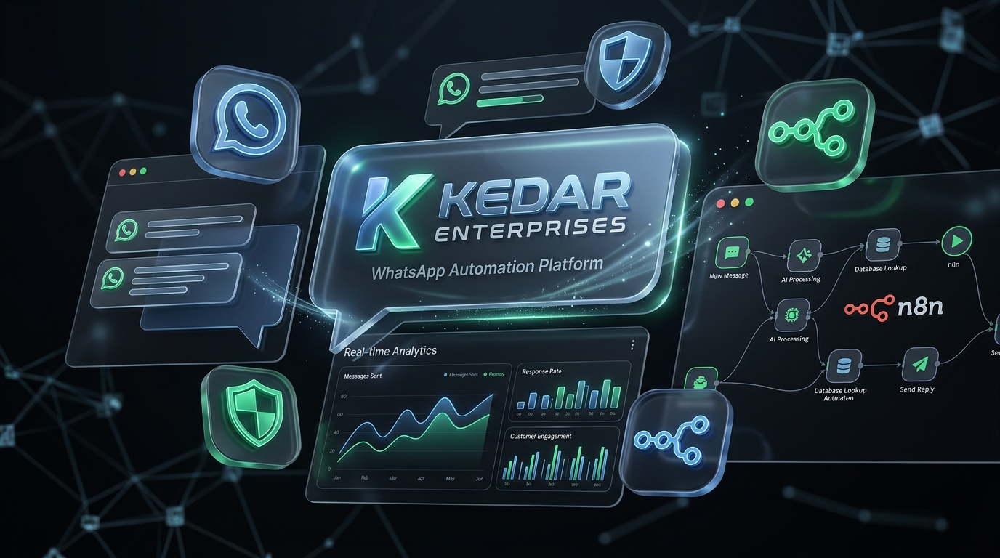

# Kedar Enterprises — WhatsApp Automation & DPDP Act 2023 Compliance Platform



[](https://nextjs.org/)
[](https://supabase.com/)
[](https://developers.facebook.com/docs/whatsapp/cloud-api)
[](https://n8n.io/)
[](https://www.typescriptlang.org/)
[](https://meity.gov.in/)

---

## 📋 Executive Overview

**Kedar Enterprises WhatsApp Automation Platform** is an enterprise-grade customer messaging, lead management, and privacy control hub. Built specifically for high-volume commercial customer interactions, it integrates **Official Meta WhatsApp Cloud API**, **n8n automation engine**, and **Supabase PostgreSQL** while adhering to India's **Digital Personal Data Protection (DPDP) Act, 2023**.

The platform enables seamless switching between **Automated Bot Handlers** (FAQ intent router, qualification state machine) and **Staff Human Takeover**, complete with audit logging, consent records, and automated data principal rights management.

---

## 🏗️ Architecture & Technology Stack

```text
                               ┌────────────────────────────────────────┐
                               │       Meta WhatsApp Cloud API          │
                               └──────────────────┬─────────────────────┘
                                                  │ Webhooks
                                                  ▼
┌────────────────────────────────────────────────────────────────────────────────────────────────┐
│                                  n8n Automation Engine                                         │
│ ┌──────────────────────┐  ┌─────────────────────┐  ┌────────────────────────────────────────┐ │
│ │ 01 Webhook Ingest    │  │ 02 Intent & FAQ     │  │ 03 Lead Qualification State Machine    │ │
│ └──────────────────────┘  └─────────────────────┘  └────────────────────────────────────────┘ │
│ ┌──────────────────────┐  ┌─────────────────────┐  ┌────────────────────────────────────────┐ │
│ │ 04 Human Handoff     │  │ 05 Scheduled Follow │  │ 06 DPDP Purge & Anonymization Cron     │ │
│ └──────────────────────┘  └─────────────────────┘  └────────────────────────────────────────┘ │
└─────────────────────────────────────────┬──────────────────────────────────────────────────────┘
                                          │ Database REST / Service Role
                                          ▼
┌────────────────────────────────────────────────────────────────────────────────────────────────┐
│                                Supabase PostgreSQL Backend                                     │
│  - Row Level Security (RLS)    - Automated updated_at triggers   - Audit Logs                  │
│  - Profiles & Roles            - Customers, Conversations & Leads - Privacy & Consent Ledger   │
└─────────────────────────────────────────▲──────────────────────────────────────────────────────┘
                                          │ Next.js SSR / Client SDK (@supabase/ssr)
                                          │
┌─────────────────────────────────────────┴──────────────────────────────────────────────────────┐
│                              Next.js 14 Web Command Center                                     │
│ ┌──────────────────────┐  ┌─────────────────────┐  ┌────────────────────────────────────────┐ │
│ │ 3-Panel Inbox        │  │ Leads Pipeline      │  │ DPDP Privacy Control Hub               │ │
│ └──────────────────────┘  └─────────────────────┘  └────────────────────────────────────────┘ │
│ ┌──────────────────────┐  ┌─────────────────────┐  ┌────────────────────────────────────────┐ │
│ │ Automation Rules     │  │ Analytics Engine    │  │ System Settings & Audit Logs           │ │
│ └──────────────────────┘  └─────────────────────┘  └────────────────────────────────────────┘ │
└────────────────────────────────────────────────────────────────────────────────────────────────┘
```

### Core Technologies

| Technology | Layer | Purpose |
| :--- | :--- | :--- |
| **Next.js 14 (App Router)** | Frontend / Dashboard | SSR, React Server Components, Client State Management |
| **TypeScript** | Runtime Safety | Type definitions across API contracts, UI components, & Supabase schema |
| **TailwindCSS & Lucide** | Design & UI | Premium glassmorphism design system, dark mode UI & icon set |
| **Recharts** | Analytics | Dynamic message volume graphs, bot-to-human resolution ratios |
| **Supabase PostgreSQL** | Database & Storage | Relational schema, Row Level Security (RLS), triggers, and indexing |
| **@supabase/ssr & @supabase/supabase-js** | Auth & SDK | Secure cookie session refresh and server/browser data fetching |
| **Meta WhatsApp Cloud API** | Channel Gateway | Graph API v20.0 for inbound/outbound messaging and template delivery |
| **n8n Automation Engine** | Workflow Logic | Asynchronous event processing, intent router, state machine, cron follow-ups |

---

## 🌟 Platform Modules & Key Features

### 1. 💬 3-Panel Live WhatsApp Inbox (`/inbox`)
- **Panel 1 — Conversation Selector**: Multi-status filtering (`OPEN`, `PENDING`, `RESOLVED`), search by customer name/phone, mode indicators (`BOT` vs `HUMAN`), and unread badges.
- **Panel 2 — Active Chat Thread**: Historical message log, direction tags (`INBOUND` / `OUTBOUND`), delivery status (`RECEIVED`, `SENT`, `DELIVERED`, `READ`, `FAILED`), and instant **Human Takeover Switch**.
- **Panel 3 — Customer Intelligence Drawer**: Lead stage, assigned agent, custom tags, location, and DPDP consent indicator.

### 2. 🛡️ DPDP Act 2023 Privacy Control Hub (`/privacy`)
- **Consent Ledger**: Audit-proof registry of purpose-specific customer consent (`GRANTED` / `WITHDRAWN`).
- **Data Principal Rights Workflow**: Right to Access, Data Correction, and Right-to-Erasure (Anonymization).
- **Grievance Redressal System**: Dedicated ticketing workflow for DPDP Officer handling privacy complaints.
- **Vendor / Data Processor Registry**: Compliance tracking for third-party processors (Meta, Supabase, n8n, Vercel).
- **Data Retention & Auto-Purge Rules**: Configurable payload retention schedules (e.g., 180-day raw message redaction).

### 3. 💼 Commercial Lead Pipeline (`/leads`)
- Interactive Kanban/List view tracking lead statuses (`NEW`, `CONTACTED`, `QUALIFIED`, `FOLLOW_UP`, `CONVERTED`, `LOST`).
- Lead assignment to staff members with product interest and commercial requirements logging.

### 4. 🤖 FAQ & Automation Rule Manager (`/automation`)
- **Deterministic Intent Router**: Keyword & category matching engine with auto-reply dispatch.
- **n8n Workflow Control**: Enable/disable triggers and track success/failure statistics.

### 5. 📊 Realtime Analytics & Audit Trail (`/analytics`, `/audit-logs`)
- Weekly message throughput, bot vs. human resolution percentages, response time metrics.
- Tamper-evident admin audit log recording staff actions and privacy executions.

---

## 🗄️ Database Architecture (`supabase/production_schema.sql`)

The database foundation comprises **11 application tables** with Row Level Security (RLS) and custom stored procedures.

```text
profiles ──┐
           ├── conversations.assigned_to
           ├── leads.assigned_to
           └── data_requests.assigned_to

customers ──┬── conversations ──── messages
            ├── leads ──────────── followups
            ├── consent_records
            └── data_requests
```

### Table Definitions Summary

| Table | Purpose | Primary Keys & Indexes |
| :--- | :--- | :--- |
| `profiles` | Admin & Staff user profiles extending `auth.users` | `id (UUID, FK auth.users)` |
| `customers` | Customer contacts with DPDP flags | `id (UUID)`, Index: `phone (UNIQUE)` |
| `conversations` | Messaging sessions (`OPEN`, `PENDING`, `RESOLVED`) | `id (UUID)`, Indexes: `customer_id`, `status`, `mode`, `assigned_to` |
| `messages` | Individual WhatsApp messages | `id (UUID)`, Indexes: `conversation_id`, `whatsapp_message_id (UNIQUE)`, `created_at` |
| `leads` | Sales leads pipeline | `id (UUID)`, Indexes: `customer_id`, `status`, `assigned_to` |
| `faqs` | Automated reply repository | `id (UUID)`, Category & keyword array |
| `automation_rules` | Workflow trigger parameters | `id (UUID)`, Configuration JSONB |
| `followups` | Scheduled template follow-ups | `id (UUID)`, Index: `scheduled_at` |
| `consent_records` | DPDP consent audit log | `id (UUID)`, `customer_id`, `status` (`GRANTED`/`WITHDRAWN`) |
| `data_requests` | Data Principal rights requests | `id (UUID)`, Request types (`ACCESS`, `ERASURE`, `CORRECTION`) |
| `audit_logs` | Platform audit events | `id (UUID)`, Index: `created_at` |

---

## 🔄 n8n Workflow Engines (`n8n/workflows/`)

The repository contains 6 production-ready n8n JSON workflow blueprints:

1. **`01_incoming_whatsapp_webhook.json`**: Receives Meta webhooks, validates signature, creates/updates `customers` and `conversations`, and inserts message into `messages`.
2. **`02_intent_router_faq.json`**: Scans incoming message content against `faqs` table keywords and dispatches automated response via Meta Cloud API if `mode = 'BOT'`.
3. **`03_lead_capture_state_machine.json`**: Evaluates customer responses to capture product requirements, location, and update `leads` status to `QUALIFIED`.
4. **`04_human_handoff_and_notification.json`**: Triggers when customer requests a human representative; updates conversation `mode` to `HUMAN` and alerts staff.
5. **`05_automated_followups_cron.json`**: Scheduled cron job that checks `followups` for pending scheduled items and fires Meta template messages.
6. **`06_dpdp_retention_and_anonymization.json`**: Periodic compliance cron that executes message content redaction for expired retention periods and anonymizes customer PII upon request.

---

## ⚡ Quick Start & Development Setup

### Prerequisites
- **Node.js**: v18.0 or higher
- **npm** or **pnpm**
- **Supabase Account**: Managed Supabase project
- **Meta Developer Account**: WhatsApp Cloud API app setup
- **n8n Instance**: Self-hosted or n8n Cloud

### 1. Clone Repository & Install Dependencies

```bash
git clone https://github.com/Sachinxcode-01/Kedar-Enterprises-Automation.git
cd Kedar-Enterprises-Automation
npm install
```

### 2. Configure Environment Variables (`.env.local`)

Create `.env.local` in the root directory:

```env
# Next.js App URL
NEXT_PUBLIC_APP_URL=http://localhost:3000

# Supabase Credentials
NEXT_PUBLIC_SUPABASE_URL=https://your-supabase-project.supabase.co
NEXT_PUBLIC_SUPABASE_PUBLISHABLE_KEY=your-supabase-publishable-key
SUPABASE_SERVICE_ROLE_KEY=your-supabase-service-role-key

# Meta WhatsApp Cloud API
META_WHATSAPP_TOKEN=EAAG...
META_WHATSAPP_PHONE_NUMBER_ID=109847583920194
META_WHATSAPP_BUSINESS_ACCOUNT_ID=948372615049382
META_WHATSAPP_VERIFY_TOKEN=kedar_whatsapp_verify_token_2026

# n8n Webhook Endpoint
N8N_WHATSAPP_WEBHOOK_URL=https://n8n.your-domain.com/webhook/whatsapp-webhook

# DPDP Settings
DPDP_COMPLIANCE_OFFICER_EMAIL=privacy@kedarenterprises.com
DPDP_DEFAULT_RETENTION_DAYS=180
```

### 3. Initialize Supabase Database

Run the idempotent database schema script in your Supabase SQL Editor:
- **[supabase/production_schema.sql](file:///c:/Users/kalin/.gemini/antigravity-ide/scratch/kedar-whatsapp-platform/supabase/production_schema.sql)**

Optionally populate development data with:
- **[supabase/seed.sql](file:///c:/Users/kalin/.gemini/antigravity-ide/scratch/kedar-whatsapp-platform/supabase/seed.sql)**

### 4. Run Development Server

```bash
npm run dev
```

Open [http://localhost:3000](http://localhost:3000) in your browser.

---

## 📁 Directory Structure

```text
.
├── n8n/
│   └── workflows/                # 6 n8n Workflow JSON Blueprints
├── src/
│   ├── app/                      # Next.js 14 App Router pages & API routes
│   │   ├── analytics/            # Message volume & bot performance metrics
│   │   ├── api/                  # Webhook & Privacy API endpoints
│   │   ├── audit-logs/           # Admin security audit logs
│   │   ├── automation/           # FAQ & Automation rule controls
│   │   ├── customers/            # Customer directory & profile management
│   │   ├── inbox/                # 3-Panel WhatsApp Inbox
│   │   ├── leads/                # Sales leads pipeline
│   │   ├── login/                # Staff authentication
│   │   ├── privacy/              # DPDP Act 2023 Privacy Hub
│   │   └── settings/             # System configuration
│   ├── components/               # Header, Sidebar, and UI Layout components
│   ├── lib/                      # Types, data mock fallbacks, and utilities
│   └── utils/
│       └── supabase/             # Server, Client, and Middleware Supabase SDK helpers
├── supabase/
│   ├── production_schema.sql     # Full SQL Database Schema + RLS + Triggers
│   ├── schema.sql                # Base SQL Schema reference
│   └── seed.sql                  # Seed data for testing
├── .env.example                  # Environment template file
├── .gitignore                    # Git exclusion rules
├── package.json                  # Dependencies & scripts
└── tsconfig.json                 # TypeScript configuration
```

---

## ⚖️ Digital Personal Data Protection (DPDP) Act 2023 Notice

This platform implements technical and organizational controls to assist **Kedar Enterprises** in adhering to India's DPDP Act, 2023:
1. **Notice & Consent**: WhatsApp opt-in records with versioned notices.
2. **Data Principal Rights**: Built-in mechanisms to process Access, Correction, and Erasure/Anonymization requests.
3. **Data Retention**: Configurable payload redaction triggers to minimize data storage.
4. **Grievance Redressal**: Audit trails and designated privacy officer ticket handling.

*Disclaimer: Software implementations provide technical primitives for compliance. Kedar Enterprises should consult legal counsel regarding organizational policies, privacy notices, data processor agreements, and audit requirements.*

---

## 📄 License & Attribution

Developed for **Kedar Enterprises**. Built with Next.js, Supabase, Meta WhatsApp Cloud API, and n8n.
